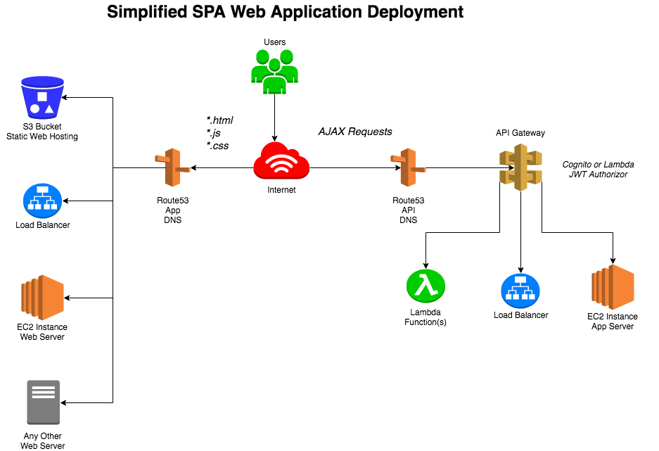

> A great idea has been flying around my head for weeks, I've done some market research and it seems like I'm really on to something! The test groups I've run it by are impressed seeing the utility and the market isn't already saturated with similar concepts.
>It's time to start making it real!

I hope you've experienced this excitement; it's one of the best parts about doing our work. Unique amongst professionals, we have the ability to take our ideas to leaders or the market not through pitches, but working examples.

# Prototyping

We tend, in software development, to refer to this step as "prototyping", and honestly it's my favorite part of the job. Some companies even dedicate time for their staff to always have this sort of prototyping outlet for some fraction of their working hours.

The issue with this is cost. Making time for prototyping is costly enough as opportunity costs range from progress on committed deadlines to that extra few hours of sleep or downtime. Compounding this is the cost of servers, setup, changeover, and provisioning to make your prototype something more than local-ware.

So; given these costs, let's make it cheaper and throw out the idea of servers, hardware and setup - instead sign up for a [free AWS account](https://aws.amazon.com/free/) and get started!

## A possible architecture

AWS is an incredible offering of services with dozens of options. Don't worry, you don't have to know any of them to follow this blog, but I will introduce a few of them as I see their efficacy for prototyping.

Assuming your prototype is a web application, this architecture should be somewhat familiar. On the left, we have standard web assets served by any of several options and referred to by a DNS name (e.g., `www.example.com`).

If you come from a classical background, each page pay require a different `*.html` page or have a server (e.g., [WordPress](https://wordpress.com/), [Laravel](https://laravel.com/), [Drupal](https://www.drupal.org/), [Django](https://www.djangoproject.com/), [Flask](http://flask.pocoo.org/), [Ruby on Rails](http://rubyonrails.org/)) handle each request, prepare a page dynamically and send it back to the user.

### A possible alternative

Let's instead discuss an alternative, serverless application design.



In this pattern, we use managed services (in this case provided by AWS) to provide working web serving of front end web pages and pay-per execution compute services for back-end logic. There are two massive advantages to this, the first being nearly zero overhead to getting started with world class infrastructure and the second being cost.

- I'll refer you to AWS's documentation here for [official site hosting costs](https://aws.amazon.com/getting-started/projects/host-static-website/services-costs/), but as of the date of this writing it will between $1 - $3 per month at scale.
- Same goes for back-compute services; see AWS's documentation for [official lambda costs](https://aws.amazon.com/lambda/pricing/), but as of this writing the first million calls are free, the $0.20 (yes, twenty-cents) for each subsequent block of one million calls.

## Typical Prototyping

Whether working by myself or with a team, prototyping projects follow arguably the same pattern. After identifying the use case

- Mock or wire frame a UI
- Identify application logic
- Define entry points
- Break!
- Write code
- Come back together
- Tie it all together

The efficacy of this approach really comes down to the level of experience with the participants in their chosen method or framework. Everyone takes a piece with which they are comfortable, and then goes for it! At the end of the prototype, it hopefully runs locally, but often has to be re-factored to follow best practices or even fit inside a "deployment ready" method.

### But what runs it?

In most prototype cases, your framework has a local run method. These vary in sophistication, but almost universally are not production ready or even capable from a load or security perspective. This does not mean that it isn't worth using locally though! It's much better to focus on core logic and get to "all the rest" after the prototype is functioning!

If you're really good (or have a strong UNIX background) you may have even built a server on which to demo the application, patched the OS, configured the web server, installed your runtime(s) or even dockerized/decomposed your provisioning for a system like Ansible, Puppet or Chef (and kudos to you!). If not (and you like your prototype), this is definitely the next step.

Your prototype then has to go from local-ware to something production ready.

### What's next?

This is where lots of people talk about "production-izing" their applications bringing in authentication/authorization, working with bigger databases, provisioning more servers, load balancing and more. These are all great steps and I personally love working on the solutions architecture of these deployments, but none of this is easy (or cheap)!

## An alternative: Serverless Prototyping

Certainly, and if you've made it this far in this blog, you may already know what it is - _serverless_ technology. If you're new to the term; I promise, I'm not insane. I know there are servers, you (the prototyper or team) just does not have a requirement to provision and manage them. Instead, it refers to the usage of services that are _managed_ by a provider.

### Why Bother with Serverless?

I've recently become an increasing fan of serverless technology for a few reasons;

1. Extremely low cost
1. Pay per use pricing
1. Automated patching/updates
1. Automatic resilience
1. Fastest possible prototyping

It's the prototyping that drove me to put this blog together, but just know that it's the cost and security features that have me thinking of serverless with each application I design.

Oh, and if you didn't know; you get 99.99% reliability and eleven-nines durability out of the box. This is the same as losing or getting corruption in a single file, per Peta-byte stored, once every eight years. S3 will even alert you if that happens. As someone who's built dozens of servers and production scale websites, I can tell you that my backup, server management and loss of sleep don't provide that level of uptime, even after all this time.

### Too good to be true, prove it

Sure!

You can do this with AWS native [cloud formation templates](https://docs.aws.amazon.com/AWSCloudFormation/latest/UserGuide/aws-properties-s3-bucket.html) (JSON or YAML files that direct resource creation), but I find them hard to follow and debug.

I could walk you through the AWS console (it's trivially simple) but my screen-shots would go out of date eventually which would be frustrating, plus infrastructure as code is so cool!

Instead, here's a [Terraform](https://www.terraform.io/) example - which I think is much easier to understand. If you don't have Terraform installed, visit their page or if you have a Mac running [homebrew](https://brew.sh/) just run `brew install terraform`.

Then, just create the following in a file called `*.tf`, for example `prototype.tf`

```hcl
provider "aws" {
    access_key = "myAwsAccessKey"
    secret_key = "myAwsSecretKey"
    region = "us-east-1"
}

resource "aws_s3_bucket" "prototype_project" {
  bucket = "prototype.my-project.ninja"
  acl    = "public-read"

  website {
    index_document = "index.html"
    error_document = "error.html"
  }
}
```

From the folder with this file, run `terraform init && terraform apply` and check your AWS account, you're good to start using the bucket immediately.

The S3 console will give you the accessible URL for the prototype site. Upload a simple page to the bucket and your `index.html` page will load and of course pull all CSS, JavaScript and whatever else you ask it to as part of the load. If something goes wrong, the error page is thrown.

## What's next?

I hope that I've peaked your interest. If so keep an eye on my blog! I'm going to follow this up with a practical example building a single page application with an AWS API Gateway and AWS Lambda compute resources.
